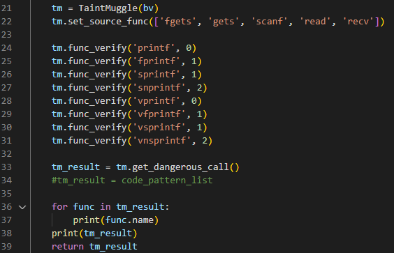
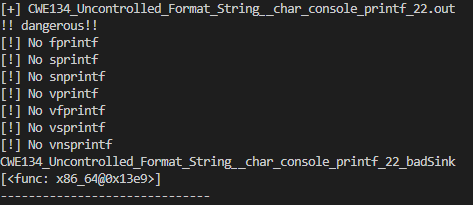
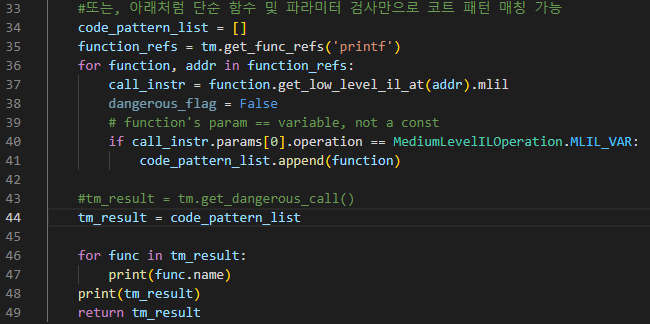
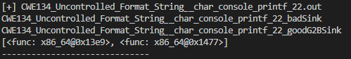

# Taint_Muggle
Stupid Variable Taint Analysis modules with Binary Ninja

## Description
The variables specified by the binary ninja are tracked by forward/backward (Taint analysis). Simply use ssa_form's `get_ssa_var_definition` and `get_ssa_var_uses`. Since many cases are not considered, they can operate "stupid" as described.

## Example
The `Taint Mugle` can be used as follows.
When detecting a format string bug, find a function such as `printf(var)` and backward slide `var`. It proceeds inter-procedure, and when it reaches the top, it analyzes it with forward. If the variable tinted in the user-specified source_func is used as a factor, it is reported as dangerous.

The following example is the result of executing a binary of one of the form strings of the Juliet test case.

Separately, a format string may be detected by simply matching a code pattern. (Instead, the source cannot be accurately determined because the paint analysis has not been performed.)

